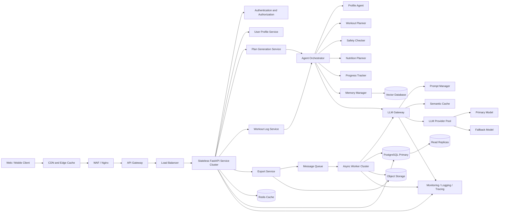
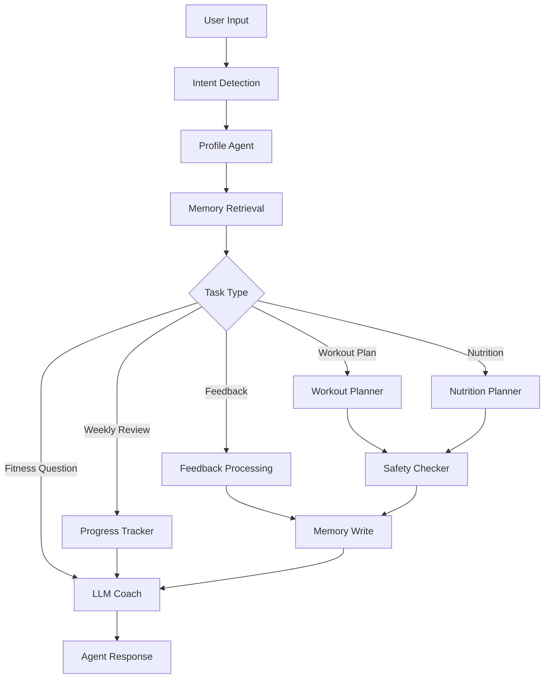
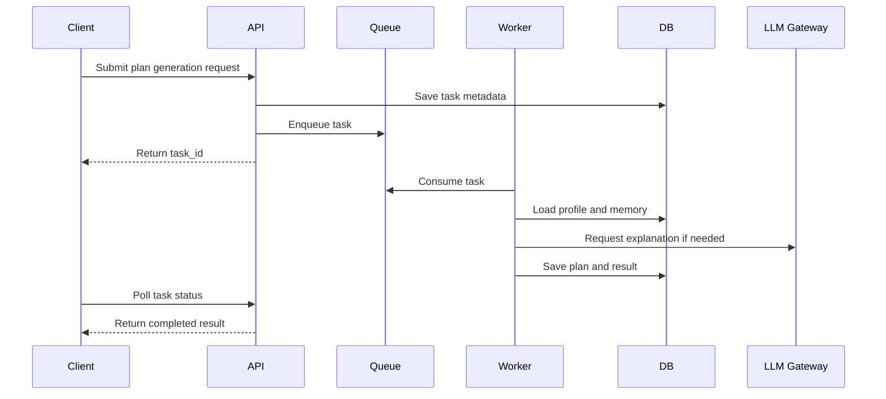

# FitAgent 工业级 AI Agent 系统架构设计报告

## 摘要

本文面向 FitAgent 这一 AI 健身助手系统，设计一套能够支撑工业级部署和 100,000 级并发访问的系统架构。FitAgent 的核心任务是根据用户画像、训练目标、运动场景和反馈记录，生成安全、可解释、可调整的训练计划，并通过大语言模型增强自然语言问答、计划解释和进度复盘能力。

与单一聊天机器人不同，FitAgent 采用多模块 Agent 架构。系统由 Orchestrator Agent 负责意图识别和流程调度，由 Profile Agent、Workout Planner、Safety Checker、Nutrition Planner、Progress Tracker、Memory Manager 和 LLM Coach 等子模块分别承担用户画像整理、训练计划生成、安全审查、习惯建议、进度分析、长期记忆和自然语言解释等职责。该设计将确定性规则、结构化数据库、缓存、异步队列、向量记忆和大模型服务组合起来，在提高个性化能力的同时降低大模型幻觉和健康建议风险。

本文档重点讨论系统在 100,000 级并发访问下的目标架构，包括 LLM Engine、Data Processing、Database、High Concurrency Support、Monitoring and Operation 等模块的职责边界、数据流、容错策略和可观测性设计。

## 1. 设计背景与目标

FitAgent 的业务场景具有三个特点。第一，用户输入带有强个体差异，例如年龄、训练经验、身体目标、运动场景和伤病备注不同。第二，输出内容具有结构化要求，训练计划必须包含动作、组数、次数、休息时间、目标肌群和安全提示。第三，系统涉及健康和运动安全，不适合完全依赖大模型自由生成。

因此，FitAgent 的目标架构不应是简单的“用户输入到大模型输出”，而应是一个受控的 AI Agent 系统：

- 规则引擎负责动作选择、训练结构和基础安全边界。
- Agent Orchestrator 负责判断请求意图并调度子模块。
- 大语言模型负责自然语言理解、解释、总结和对话增强。
- 数据库和记忆系统负责保存用户画像、训练计划、反馈和调用记录。
- 高并发支撑模块负责缓存、异步处理、限流、降级和弹性扩缩容。
- 监控运维模块负责指标采集、日志追踪、告警和成本监测。

本文的设计目标包括：

1. 支持 100,000 级并发访问。
2. 保持用户交互链路低延迟。
3. 支持大模型调用失败时的安全降级。
4. 支持用户长期记忆和个性化计划调整。
5. 支持训练计划、反馈、日志和报告的可追踪存储。
6. 支持系统级监控、告警、审计和成本分析。
7. 避免大模型直接绕过安全模块生成高风险建议。

## 2. 系统需求分析

### 2.1 功能性需求

FitAgent 需要支持以下核心功能：

- 用户画像管理：保存年龄、性别、身高、体重、训练水平、目标和伤病备注。
- 训练目标解析：识别圆肩、驼背、骨盆前倾、核心无力、减脂、增肌等目标。
- 场景化训练计划生成：支持居家、健身房和混合场景。
- 结构化计划展示：输出每周训练日、动作、组数、次数、休息时间和安全提示。
- 动作图像支持：根据用户性别和训练场景展示动作图片。
- 计划编辑与保存：用户可修改动作、组数、次数和休息时间。
- 训练日志记录：记录用户完成训练的日期、训练日编号和反馈。
- 周期性进度分析：统计完成率并给出调整建议。
- 健身问答：用户可在顶部健身小助手中询问通用健身问题。
- Agent 工作流展示：展示系统中不同 agent 模块如何协作。
- 大模型状态展示：同步显示模型是否接入、是否参与本次生成、是否降级。
- 文档导出：将训练计划导出为 PDF/打印、Markdown、CSV 或 JSON。

### 2.2 非功能性需求

面向工业级部署，系统还需要满足以下非功能性需求：

- 可扩展性：后端服务应无状态化，并支持水平扩展。
- 高可用性：单个服务实例、模型供应商或缓存节点故障不应导致整体不可用。
- 低延迟：普通读写请求应尽量在短时间内返回，耗时任务应异步化。
- 一致性：用户计划、日志、反馈和记忆应具备清晰的数据一致性策略。
- 安全性：用户健康相关数据应最小化采集、权限隔离、加密传输。
- 可观测性：系统应记录 API 延迟、错误率、LLM 失败率、队列积压和成本。
- 可降级性：大模型不可用时，应回退到规则计划和模板化解释。
- 可审计性：LLM 调用、计划修改、安全提醒和用户反馈应可追踪。

## 3. 并发规模与容量假设

100,000 级并发可以从系统设计角度理解为：同一时间存在约 100,000 个活跃连接或活跃会话，其中只有一部分会在同一秒内发起高成本请求。为了设计系统容量，需要对请求类型进行拆分。

一种合理假设如下：

| 请求类型 | 占比 | 处理方式 |
| --- | --- | --- |
| 静态资源加载 | 高 | CDN 缓存 |
| 读取计划与历史记录 | 高 | API + Redis + PostgreSQL Read Replica |
| 保存打卡与反馈 | 中 | API + PostgreSQL |
| 生成训练计划 | 中 | API + Queue + Worker |
| 大模型解释和问答 | 中低 | LLM Gateway + Cache + Circuit Breaker |
| 导出报告 | 低 | Queue + Worker + Object Storage |

核心设计原则是：不要让所有用户请求都同步穿过完整的 AI 推理链路。静态资源走 CDN，热点数据走 Redis，耗时任务进入队列，LLM 调用通过统一网关治理，核心数据由 PostgreSQL 持久化，长期语义记忆由 Vector Database 支持。

## 4. 总体系统架构

FitAgent 的工业级架构可以划分为七层：

1. 用户访问层：Web Frontend、未来移动端、浏览器缓存。
2. 边缘接入层：CDN、WAF、Nginx、API Gateway、Load Balancer。
3. 应用服务层：用户服务、计划服务、日志服务、反馈服务、导出服务。
4. Agent 编排层：Orchestrator Agent 和多个子 agent。
5. LLM 引擎层：LLM Gateway、Provider Pool、Prompt Manager、Semantic Cache。
6. 数据层：PostgreSQL、Redis、Vector Database、Object Storage。
7. 运维观测层：Metrics、Logs、Tracing、Alerting、Audit。

### 4.1 总体架构图



该架构将用户请求分为同步链路和异步链路。读取、保存和轻量问答可以同步返回；计划生成、LLM 总结、周报生成和文档导出等任务可以通过消息队列交给 Worker Cluster 异步处理。

## 5. Agent 编排层设计

### 5.1 Orchestrator Agent

Orchestrator Agent 是系统的核心调度模块。它不直接承担所有计算，而是负责判断用户意图并选择合适的工具。

主要职责包括：

- 对用户请求进行意图分类。
- 读取用户画像和历史记忆。
- 调用 Workout Planner 生成训练计划。
- 调用 Safety Checker 审查风险。
- 调用 Nutrition Planner 生成保守习惯建议。
- 调用 Progress Tracker 分析训练日志。
- 调用 LLM Coach 生成解释性回答。
- 将本次请求、反馈或安全提醒写入 Memory Manager。

### 5.2 子 Agent 职责划分

| 子模块 | 输入 | 输出 | 主要作用 |
| --- | --- | --- | --- |
| Profile Agent | 用户资料、当前表单上下文 | 标准化用户画像 | 统一下游模块的数据格式 |
| Workout Planner | 用户画像、目标、场景、频率、时长 | 结构化训练计划 | 生成动作、组数、次数和训练日安排 |
| Safety Checker | 用户画像、训练计划 | 风险等级、安全提醒 | 防止明显高风险建议 |
| Nutrition Planner | 用户画像、目标 | 饮食习惯建议 | 提供一般健康教育，不做医疗处方 |
| Progress Tracker | 训练日志、目标频率 | 完成率、调整建议 | 支持周复盘和计划调整 |
| Memory Manager | 用户反馈、历史请求 | 长期记忆 | 保存偏好、困难和安全上下文 |
| LLM Coach | 结构化上下文、用户问题 | 自然语言解释 | 增强对话和解释能力 |

### 5.3 Agent 工作流图



这种设计的关键点在于：LLM 并不是唯一决策者。训练计划的结构、动作选择和安全边界由确定性模块控制，LLM 主要用于语言理解、解释和总结。

## 6. LLM Engine 模块设计

LLM Engine 是所有大模型调用的统一入口。它不应分散在各个业务服务中，否则难以治理成本、延迟、失败和安全边界。

### 6.1 LLM Engine 的组成

```text
LLM Gateway
  -> Provider Router
  -> Prompt Manager
  -> Context Builder
  -> Semantic Cache
  -> Safety Guardrails
  -> Output Validator
  -> Cost Tracker
  -> Call Logger
```

各组件职责如下：

- Provider Router：根据任务类型、延迟、成本和可用性选择模型。
- Prompt Manager：维护不同任务的系统提示词和输出格式要求。
- Context Builder：压缩用户画像、当前计划、记忆和安全信息。
- Semantic Cache：缓存常见健身问答和通用解释。
- Safety Guardrails：限制医疗诊断、极端减脂和高风险训练建议。
- Output Validator：检查模型输出是否为空、是否越界、是否符合格式。
- Cost Tracker：记录 token 使用和模型调用成本。
- Call Logger：记录 provider、model、prompt_type、latency、status 和错误。

### 6.2 LLM 在 FitAgent 中的边界

LLM 适合承担：

- 自然语言意图理解。
- 训练计划解释。
- 用户追问回答。
- 周复盘总结。
- 反馈改写和建议表达。

LLM 不应直接承担：

- 绕过动作库自由编造训练动作。
- 绕过 Safety Checker 给出高风险建议。
- 输出医疗诊断或治疗承诺。
- 在没有用户画像和安全上下文时给出强个体化建议。

### 6.3 Provider Pool 与降级策略

工业级系统中，大模型调用必须考虑外部服务不稳定。LLM Gateway 应支持：

```text
Primary Model
  -> Fallback Model
  -> Smaller Model
  -> Cached Safe Answer
  -> Rule-based Template
```

当模型超时或失败时，系统不应阻塞主流程。对于训练计划生成，规则计划可以先返回；LLM 解释可以稍后补充，或者使用模板化解释代替。

## 7. Data Processing 模块设计

Data Processing 模块负责把用户原始输入转化为可计算、可检索、可复用的数据。

### 7.1 用户输入处理

用户输入包括结构化字段和自然语言字段。结构化字段如年龄、性别、训练水平、每周训练次数；自然语言字段如“久坐后腰酸”“肩膀前扣”“膝盖往里扣”。系统应先将这些输入标准化，再交给后续模块。

处理流程：

```text
Raw Input
  -> Field Validation
  -> Profile Normalization
  -> Problem Mapping
  -> Target Muscle Extraction
  -> Scenario and Equipment Filtering
  -> Plan Generation Context
```

### 7.2 训练计划数据处理

训练计划生成需要综合：

- 用户画像。
- 训练目标。
- 目标肌群。
- 可用场景。
- 单次训练时长。
- 每周训练频率。
- 动作库难度。
- 安全风险标签。

推荐结果应以结构化形式保存，而不是仅保存自然语言文本。这样后续才能编辑、导出、复盘和统计。

### 7.3 反馈与记忆处理

用户反馈是系统个性化能力的重要来源。反馈可以分为：

- 难度反馈：太难、太轻松、刚刚好。
- 疼痛反馈：膝盖、腰背、肩颈等部位不适。
- 偏好反馈：喜欢居家训练、不喜欢某个动作。
- 执行反馈：完成率低、时间不足、动作不理解。

这些反馈应进入结构化数据库和长期语义记忆。下一次生成计划时，Memory Manager 可以检索相关反馈并传给 Orchestrator。

## 8. 数据库与存储设计

### 8.1 存储组件分工

| 存储组件 | 主要数据 | 设计理由 |
| --- | --- | --- |
| PostgreSQL | 用户、计划、日志、反馈、调用记录 | 事务一致性强，适合核心业务数据 |
| Redis | 会话、限流计数、任务状态、热点缓存 | 低延迟，适合高并发读写 |
| Vector Database | 长期语义记忆、用户反馈向量 | 支持语义检索和个性化上下文召回 |
| Object Storage | 导出报告、图片资源、生成文件 | 降低数据库文件存储压力 |
| Log Storage | 应用日志、审计日志、模型调用日志 | 支持排障、审计和离线分析 |

### 8.2 关系型数据模型

核心表可以包括：

- users：用户基础信息。
- user_profiles：标准化用户画像。
- plans：训练计划元数据。
- plan_days：计划中的训练日。
- plan_exercises：训练日中的具体动作。
- workout_logs：训练完成记录。
- feedback_logs：用户反馈记录。
- agent_memory：Agent 记忆。
- llm_call_logs：大模型调用日志。
- audit_logs：关键操作审计。

### 8.3 数据一致性策略

FitAgent 中存在两类数据一致性要求。

强一致性数据包括：

- 用户资料修改。
- 计划保存。
- 训练打卡。
- 用户反馈。

这些数据需要写入 PostgreSQL 并保证事务完整。

最终一致性数据包括：

- LLM 解释文案。
- 周复盘总结。
- 导出文件。
- 长期语义记忆向量。
- 离线统计指标。

这些数据可以通过队列异步生成，在稍后补充到结果中。

## 9. 高并发支撑模块设计

### 9.1 静态资源分发

前端 HTML、CSS、JavaScript、动作图片和图标应通过 CDN 分发。这样大部分静态资源请求不会到达后端服务，可显著降低源站压力。

### 9.2 无状态应用服务

FastAPI 服务实例应保持无状态。用户会话、任务状态和缓存数据放入 Redis 或数据库。这样 API 服务可以根据流量水平动态增加或减少实例。

### 9.3 API Gateway 与限流

API Gateway 负责：

- 身份认证。
- 请求路由。
- IP 和用户级限流。
- 请求体大小限制。
- 接口级配额。
- 基础安全过滤。
- 灰度发布和版本路由。

对于高成本接口，例如计划生成、LLM 问答和报告导出，应设置更严格的限流和排队策略。

### 9.4 Redis 缓存策略

Redis 可缓存：

- 用户最近画像摘要。
- 动作库查询结果。
- 常见问题映射结果。
- 计划生成任务状态。
- 高频通用问答结果。
- API rate limit 计数。
- 幂等请求 key。

缓存策略需要设置合理 TTL，避免长期保存过期健康数据。

### 9.5 消息队列与异步任务

计划生成、周复盘、导出报告、LLM retry 和离线统计都适合放入消息队列。



该设计避免用户请求被外部模型延迟直接阻塞。

### 9.6 数据库扩展

PostgreSQL 可通过以下方式支持高并发：

- 主从复制。
- 读写分离。
- 连接池。
- 针对 user_id、plan_id、created_at 建立索引。
- 大表按时间或用户维度分区。
- 定期归档历史日志。
- 慢查询监控和执行计划分析。

## 10. Monitoring and Operation 模块设计

工业级 AI 系统必须具备可观测性，否则很难定位高延迟、模型失败、队列积压和成本异常。

### 10.1 指标监控

核心指标包括：

| 类型 | 指标 |
| --- | --- |
| API | QPS、p50/p95/p99 latency、4xx/5xx error rate |
| LLM | latency、timeout rate、failure rate、token usage、fallback count |
| Queue | queue length、oldest task age、worker success rate、dead-letter count |
| Database | connection count、slow query count、replication lag、lock wait |
| Redis | hit ratio、memory usage、eviction count |
| Agent | intent distribution、plan generation success rate、safety warning count |
| Product Safety | pain-related query count、high-risk warning count、blocked output count |

### 10.2 日志与链路追踪

每个请求应包含 trace_id，并贯穿 API Gateway、业务服务、Agent Orchestrator、LLM Gateway、数据库和队列 Worker。日志应结构化存储，便于按用户、任务、模型、错误类型和时间范围检索。

LLM 调用日志需要记录：

- provider。
- model。
- prompt_type。
- token 使用量。
- latency。
- status。
- fallback 是否发生。
- 脱敏后的 error_message。

### 10.3 告警策略

系统应在以下情况下触发告警：

- API p95 延迟持续超过阈值。
- 5xx 错误率异常升高。
- 队列长度持续增长。
- LLM 超时率或失败率升高。
- PostgreSQL 慢查询或连接数异常。
- Redis 命中率显著下降。
- 计划生成成功率下降。
- Safety Checker 高风险输出拦截数量异常。

## 11. 安全、隐私与健康边界

FitAgent 涉及用户身体数据、训练偏好、伤病备注和反馈记录，系统应采用较严格的安全设计。

### 11.1 数据安全

- 全站 HTTPS。
- 用户身份认证和访问控制。
- 密码安全哈希存储。
- API Key 仅保存在服务端环境变量中。
- 日志中不记录明文密钥和敏感字段。
- 用户只能访问自己的计划、反馈和日志。
- 重要操作写入 audit_logs。

### 11.2 隐私保护

- 只采集生成训练建议所需的数据。
- 健康相关备注进行最小化存储。
- 支持用户数据导出和删除。
- 长期日志设置保留期限。
- 传给 LLM 的上下文进行压缩和脱敏。

### 11.3 健康安全边界

系统必须明确：

- FitAgent 只提供一般健身和体态改善建议。
- FitAgent 不提供医学诊断、治疗方案或康复处方。
- 用户如有疼痛、运动损伤、慢性疾病、孕期或严重不适，应咨询合格专业人士。
- LLM 输出不能绕过 Safety Checker。
- 高风险问题应触发安全提醒或降级回答。

## 12. 可靠性与降级设计

### 12.1 LLM 失败

当 LLM Provider 超时、额度不足、返回空结果或接口错误时，LLM Gateway 应执行：

```text
Retry once
  -> Fallback provider
  -> Smaller model
  -> Cached answer
  -> Rule-based template
```

前端应显示模型状态，例如“大模型调用异常，已回退为规则模式”，而不是让用户误以为所有模块都失败。

### 12.2 Redis 失败

Redis 失败时，系统可以短期回退到数据库查询，但应同时收紧限流，避免所有缓存流量直接压向 PostgreSQL。

### 12.3 PostgreSQL 失败

PostgreSQL 主库故障时，应通过高可用机制切换到备用主库。只读请求可临时使用 Read Replica，写入请求可短时间排队或返回明确的重试提示。

### 12.4 队列积压

当队列积压严重时，系统应优先处理核心任务，例如计划保存、训练打卡和安全相关反馈。低优先级任务，例如报告导出和离线分析，可以延后执行。

## 13. 部署拓扑

工业级部署可采用容器化和编排平台：

```text
Kubernetes Cluster
  - Ingress Controller
  - API Gateway
  - FastAPI Service Pods
  - Worker Pods
  - LLM Gateway Pods
  - Redis Cluster
  - PostgreSQL Managed Service
  - Vector Database Service
  - Object Storage
  - Monitoring Stack
```

部署策略包括：

- Rolling Update。
- Blue-Green Deployment。
- Canary Release。
- 自动扩缩容。
- 数据库迁移脚本。
- 回滚策略。
- 配置和密钥分离管理。

## 14. 设计讨论

FitAgent 的关键设计取舍在于如何分配规则模块和大模型模块的职责。如果完全依赖大模型生成训练计划，系统可能获得更自由的表达能力，但会降低输出稳定性和安全可控性。相反，如果完全依赖规则，系统又会缺少自然语言理解和个性化解释能力。

因此，本文采用混合式 AI Agent 架构：

```text
规则模块负责确定性决策
大模型负责自然语言理解和解释
Agent Orchestrator 负责流程调度
Safety Checker 负责健康边界
Memory Manager 负责长期个性化
```

该设计符合健康类 AI 应用对可控性、可解释性和容错能力的要求。系统既能利用大模型的语言能力，又不会让大模型成为不受约束的唯一决策者。

## 15. 结论

本文提出了一套面向 FitAgent 的工业级 AI Agent 系统架构。该架构围绕多 Agent 协作、结构化训练计划、LLM Gateway、高并发支撑、数据分层存储、异步任务处理、监控运维和安全降级展开。系统在 100,000 级并发场景下，不依赖单一服务同步处理全部请求，而是通过 CDN、API Gateway、无状态服务集群、Redis、消息队列、Worker Cluster、PostgreSQL、Vector Database 和 LLM Provider Pool 共同支撑大规模访问。

从系统设计角度看，FitAgent 的核心价值不在于简单调用大模型，而在于将大模型嵌入一个可观测、可控制、可降级的 Agent 工作流中。该架构能够在保证训练建议安全边界的前提下，提供个性化、可解释和可持续迭代的 AI 健身助手能力。

## 参考资料

- System Design Handbook, AI System Design Guide: https://www.systemdesignhandbook.com/guides/ai-system-design/
- System Design Primer: https://github.com/donnemartin/system-design-primer
- System Design 101: https://github.com/ByteByteGoHq/system-design-101

