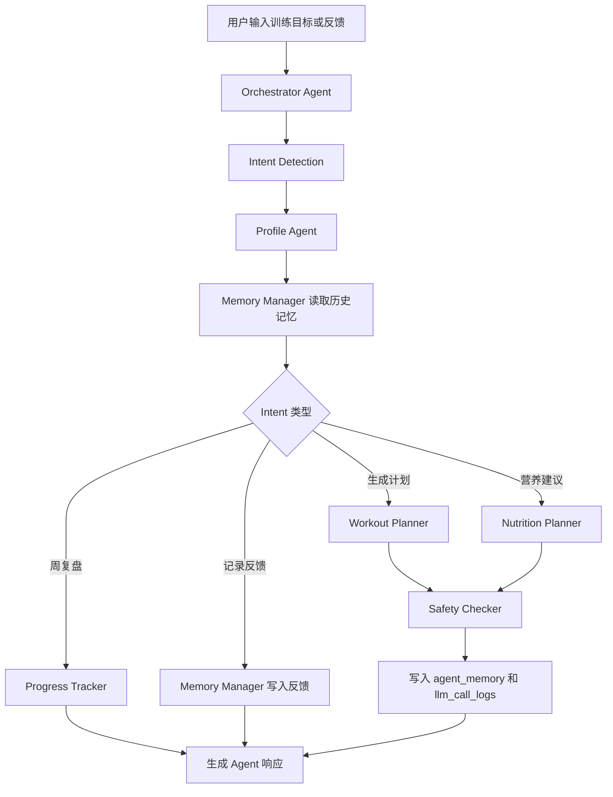

# FitAgent 中文 Agent 讲解报告

## 1. 项目定位

FitAgent 是一个面向健身新手、学生和轻度健身用户的 AI Personal Fitness Coach。它的目标不是只回答一次“我该怎么练”，而是作为一个持续陪伴型 Agent，根据用户画像、训练目标、器械条件、伤病备注、每周时间安排和训练反馈，生成、解释、检查并逐步调整训练计划。

本项目最初是一个姿态和体态训练 demo，现在已经升级为一个具备 Agent workflow、长期记忆、工具调用、结构化数据库和工程化架构文档的课程项目 MVP。

一句话概括：

> FitAgent = 健身计划生成器 + 安全检查器 + 进度跟踪器 + 长期记忆 + 可扩展 LLM Orchestrator。

## 2. 为什么它不只是 Chatbot

普通健身聊天机器人通常只完成一次问答：

```text
用户提问 -> LLM 生成回答 -> 对话结束
```

FitAgent 的设计更接近 Agent，因为它会把用户请求拆成多个步骤，并调用不同模块完成任务：

```text
用户请求
-> 判断意图
-> 读取用户画像
-> 读取历史记忆
-> 调用训练计划工具
-> 调用安全检查工具
-> 调用营养建议工具
-> 写入记忆和 LLM 调用日志
-> 返回结构化结果
```

它和普通 chatbot 的区别主要有四点：

1. 有明确的 workflow，而不是一次性生成自然语言。
2. 有模块化工具，每个 Agent 子模块只负责一个边界清晰的任务。
3. 有长期记忆，能够把用户偏好、最新请求和安全提醒存入数据库。
4. 有结构化输出，训练计划不是一段随意文字，而是可编辑、可保存、可记录完成情况的数据。

## 3. 当前已实现的 Agent 架构

当前代码中新增了 `agents/` 目录，包含以下模块：

```text
agents/
  orchestrator.py
  profile_agent.py
  workout_planner.py
  nutrition_planner.py
  safety_checker.py
  progress_tracker.py
  memory_manager.py
```

这些模块共同组成了 FitAgent 的 MVP Agent workflow。

## 4. Orchestrator Agent 讲解

文件位置：

```text
agents/orchestrator.py
```

Orchestrator Agent 是整个系统的大脑，负责判断用户意图并路由到不同子模块。

当前支持的 intent：

| Intent | 含义 | 对应场景 |
| --- | --- | --- |
| `generate_workout_plan` | 生成训练计划 | 用户说想要 workout、plan、训练、计划 |
| `record_feedback` | 记录训练反馈 | 用户说 too hard、pain、反馈、疼 |
| `weekly_review` | 生成周复盘 | 用户说 weekly report、review、progress、周报 |
| `nutrition_advice` | 生成营养建议 | 用户说 diet、nutrition、meal、饮食、营养 |
| `general_fitness_question` | 普通健身问题 | 无法匹配其他意图时使用 |

工作流程：

```text
1. 接收 message 和 payload
2. detect_intent 判断用户意图
3. ProfileAgent 整理用户画像
4. MemoryManager 读取最近记忆
5. 根据 intent 调用对应工具
6. 对训练计划执行 SafetyChecker
7. 必要时写入 agent_memory
8. 返回结构化 JSON
```

当前实现状态：

- Implemented：意图识别、模块路由、训练计划 workflow、营养建议 workflow、周复盘 workflow、反馈记忆写入。
- Partially implemented：意图识别仍是关键词规则，不是 LLM intent classifier。
- Future work：使用 LLM 或小模型做多轮对话状态管理、复杂任务规划和工具选择。

## 5. Profile Agent 讲解

文件位置：

```text
agents/profile_agent.py
```

Profile Agent 负责把数据库中的用户信息整理成 Agent 可以统一使用的画像格式。

画像字段包括：

- `user_id`
- `name`
- `age`
- `gender`
- `height_cm`
- `weight_kg`
- `fitness_goal`
- `training_level`
- `injuries`
- `weekly_frequency`
- `available_equipment`
- `diet_preference`
- `training_experience`

它的作用不是复杂推理，而是统一上下文。这样 Workout Planner、Nutrition Planner 和 Safety Checker 不需要直接依赖数据库表结构，只需要读取统一 profile。

当前实现状态：

- Implemented：从 `User` 模型提取基础画像。
- Implemented：把本次请求中的附加字段合并进 profile。
- Future work：自动总结长期训练习惯、设备偏好、时间偏好和恢复能力。

## 6. Workout Planner 讲解

文件位置：

```text
agents/workout_planner.py
recommendation_engine.py
```

Workout Planner 是训练计划生成工具。它没有让 LLM 直接自由生成动作，而是调用已有的规则推荐引擎 `generate_recommendation()`。

这样设计的原因：

1. 健身建议涉及安全，完全依赖 LLM 容易出现不合适动作。
2. 规则引擎可以保证动作来自项目内置 exercise library。
3. 输出结构固定，便于前端编辑、保存和记录。
4. LLM 未来更适合负责解释、总结和对话语气，而不是直接决定所有训练细节。

输入信息：

- 用户训练水平
- 目标问题描述
- 每周训练频率
- 单次训练时长
- 训练场景：home、gym、mixed
- 可选 mixed schedule

输出结构：

- `problem_analysis`
- `target_muscles`
- `training_focus`
- `recommended_exercises`
- `weekly_plan`

当前实现状态：

- Implemented：home/gym/mixed 训练计划生成。
- Implemented：根据训练目标匹配目标肌群。
- Implemented：根据训练水平过滤动作难度。
- Future work：根据反馈自动替换动作、调整组数和强度。

## 7. Safety Checker 讲解

文件位置：

```text
agents/safety_checker.py
```

Safety Checker 用来检查训练计划中明显的风险。因为 FitAgent 涉及健康建议，所以必须明确安全边界。

当前检查规则：

| 风险场景 | 检查逻辑 |
| --- | --- |
| 膝盖伤病 + 高冲击动作 | 检查 injury notes 和计划文本 |
| 新手训练频率过高 | beginner 且每周超过 5 次 |
| 没有休息日 | 每周训练 7 次 |
| 疼痛/头晕/麻木等高风险输入 | 提醒停止训练并咨询专业人士 |

输出示例：

```json
{
  "risk_level": "review_needed",
  "warnings": [
    "Beginner frequency above 5 sessions per week may reduce recovery."
  ],
  "disclaimer": "This is a basic automated safety screen, not medical clearance."
}
```

当前实现状态：

- Implemented：基础风险规则。
- Implemented：返回风险等级和 warnings。
- Future work：更细粒度动作风险分类、训练量负荷评估、医生/物理治疗师审核规则库。

## 8. Nutrition Planner 讲解

文件位置：

```text
agents/nutrition_planner.py
```

Nutrition Planner 只提供保守的生活方式和饮食习惯建议，不提供医疗诊断、治疗方案或极端减脂建议。

设计原则：

- 不提供疾病治疗建议。
- 不承诺减脂、增肌或体态矫正结果。
- 强调蛋白质、蔬果、水分、规律饮食和恢复。
- 对有疾病或特殊情况的用户建议咨询专业人士。

当前实现状态：

- Implemented：根据目标返回基础营养建议。
- Implemented：附带 disclaimer。
- Future work：结合用户饮食偏好、预算、过敏信息和训练日程生成更细计划。

## 9. Progress Tracker 讲解

文件位置：

```text
agents/progress_tracker.py
```

Progress Tracker 负责读取用户训练日志，并生成简单复盘。

当前逻辑：

```text
completed_sessions = 已完成训练次数
target_frequency = 目标每周训练次数
completion_ratio = completed_sessions / target_frequency
```

根据完成率给出建议：

- 0 次完成：提醒先完成第一节训练。
- 完成率较低：建议降低频率或缩短单次训练。
- 完成率较高：建议先保持稳定，再逐步增加训练量。

当前实现状态：

- Implemented：读取 workout logs 并生成完成率。
- Partially implemented：还没有把复盘展示到前端页面。
- Future work：自动生成周报、趋势图、训练负荷变化和 habit score。

## 10. Memory Manager 讲解

文件位置：

```text
agents/memory_manager.py
database.py -> AgentMemory
```

Memory Manager 是 FitAgent 从 demo 走向 Agent 的关键模块之一。它负责把长期有用的信息存入数据库。

当前会记录的信息包括：

- 用户最新训练请求。
- 用户反馈。
- 安全风险提醒。
- 后续可扩展为设备偏好、训练时间偏好、动作不适记录等。

数据库表：

```text
agent_memory
```

核心字段：

- `user_id`
- `memory_type`
- `key`
- `value`
- `confidence`
- `source`
- `created_at`
- `updated_at`

当前实现状态：

- Implemented：SQLite 记忆写入和最近记忆读取。
- Partially implemented：只是简单 key-value memory。
- Future work：向量数据库、embedding 检索、记忆去重、记忆总结和隐私删除机制。

## 11. Agent Workflow API

新增接口：

```text
POST /api/agent/run
```

请求示例：

```json
{
  "user_id": 1,
  "message": "Create a 3 day home workout plan for rounded shoulders",
  "weekly_frequency": 3,
  "session_minutes": 30,
  "scenario": "home"
}
```

响应中会包含：

- `intent`
- `profile`
- `memory`
- `plan`
- `safety_review`
- `nutrition_guidance`
- `next_actions`

这个接口是 Agent workflow 的统一入口。未来可以让前端聊天窗口、移动端 App 或第三方 API 都通过这个接口调用 FitAgent。

## 12. 数据库层如何支持 Agent

新增或补充的 Agent 相关表：

| 表名 | 作用 |
| --- | --- |
| `users` | 基础用户信息 |
| `user_profiles` | 标准化用户画像 |
| `chat_sessions` | 对话会话 |
| `agent_memory` | 长期记忆 |
| `workout_plans` | Agent 结构化训练计划快照 |
| `workout_logs` | 已完成训练记录 |
| `feedback_logs` | 用户反馈记录 |
| `llm_call_logs` | LLM 或本地 Agent 调用日志 |

这些表让项目具备了更像真实 AI product 的数据基础：

- 可以追踪用户是谁。
- 可以知道用户之前练过什么。
- 可以记录用户反馈。
- 可以分析 Agent 调用了什么工具。
- 可以未来统计 token cost、失败率和 fallback 次数。

## 13. LLM 在当前项目中的角色

当前项目没有直接调用真实 LLM API。原因是课程 MVP 阶段更重要的是把 Agent 架构和数据流跑通，避免把核心逻辑完全依赖外部模型。

当前 LLM 相关状态：

- Implemented：`OPENAI_API_KEY` / `LLM_API_KEY` 预留入口。
- Implemented：`llm_call_logs` 表记录本地 orchestrator 调用。
- Partially implemented：agent summary 是本地 mock explanation。
- Future work：接入真实 LLM provider pool，用于解释、总结、周报、自然语言对话。

推荐未来 LLM 分工：

| 任务 | 是否适合 LLM |
| --- | --- |
| 判断用户意图 | 适合，但需要 fallback |
| 解释训练计划 | 适合 |
| 周报总结 | 适合 |
| 鼓励和习惯建议 | 适合 |
| 直接决定高风险训练动作 | 不建议完全交给 LLM |
| 医疗诊断 | 禁止 |

## 14. 安全边界

FitAgent 必须明确声明：

- 不提供医疗诊断。
- 不提供治疗方案。
- 不保证矫正体态、治愈疼痛或达到某种身体结果。
- 如果用户有疼痛、受伤、慢性病、怀孕、头晕、麻木等情况，应咨询专业人士。
- 极端减肥、过度训练、高风险训练请求应被拒绝或温和纠正。

这是健身 Agent 产品和普通工具类项目最大的区别之一：它必须把 safety 作为系统的一部分，而不是只在页面底部放一句免责声明。

## 15. 当前实现边界

### Implemented

- FastAPI 后端。
- SQLite 数据库。
- 用户创建和 profile 同步。
- 规则训练计划生成。
- Agent workflow endpoint。
- Orchestrator Agent。
- Profile Agent。
- Workout Planner。
- Nutrition Planner。
- Safety Checker。
- Progress Tracker。
- Memory Manager。
- LLM call log。
- Pytest 测试。
- 中文/英文课程文档。

### Partially implemented

- 长期记忆：目前是 SQLite key-value，不是语义记忆。
- 周复盘：后端逻辑已存在，前端还未完整展示。
- 安全检查：当前是基础规则，不是医学级审核。
- LLM：当前是 mock/local workflow，没有真实模型调用。

### Designed only

- 100,000 级并发架构。
- Redis cache。
- Semantic cache。
- Message queue。
- Vector database。
- LLM provider pool。
- Circuit breaker。
- Production monitoring。
- Cost control dashboard。

### Future work

- 将 `/api/agent/run` 接入前端聊天式交互。
- 添加训练反馈表单。
- 根据反馈自动调整下一周计划。
- 接入真实 LLM，并记录 prompt、tokens、latency 和 fallback。
- 增加向量记忆和用户长期画像总结。
- 增加可视化进度图表。

## 16. 工程化亮点

本项目适合课程展示的工程化点：

1. 没有盲目重写原 demo，而是在原有 FastAPI + SQLite + 前端基础上渐进增强。
2. 保留了原有 `/api/generate-plan`，同时新增 `/api/agent/run`。
3. 训练计划仍由规则引擎控制，降低 LLM 幻觉风险。
4. Agent 模块职责清晰，便于后续替换为真实 LLM tools。
5. 数据库表设计覆盖用户、记忆、日志、反馈和 LLM 观测。
6. 文档中明确区分已实现、部分实现、仅设计和未来工作。
7. 增加了测试，验证 Orchestrator、Profile、Planner 和 Safety Checker。

## 17. 可用于答辩的讲解版本

如果需要用 1 分钟介绍，可以这样说：

> FitAgent 是一个面向健身新手的 AI 健身 Agent。它不是普通聊天机器人，而是通过 Orchestrator 判断用户意图，再调用 Profile Agent、Workout Planner、Safety Checker、Nutrition Planner、Progress Tracker 和 Memory Manager 完成一个完整 workflow。当前 MVP 已经实现用户画像、规则化训练计划生成、训练日志、基础安全检查、SQLite 长期记忆和 LLM 调用日志。生产级能力如 100k 并发、Redis、消息队列、向量数据库和真实 LLM provider pool 已在架构文档中设计，但没有虚构为已上线功能。

如果需要用 3 分钟介绍，可以这样说：

> 本项目从一个姿态训练 demo 升级为 FitAgent，一个 AI Personal Fitness Coach。系统的核心思想是把健身建议拆成多个可控模块，而不是让 LLM 一次性生成全部答案。用户输入目标后，Orchestrator 先判断意图，然后 Profile Agent 整理用户画像，Memory Manager 读取历史偏好，Workout Planner 调用规则推荐引擎生成结构化周计划，Safety Checker 检查明显风险，Nutrition Planner 给出保守饮食建议，最后系统把有用信息写入长期记忆并记录 LLM 调用日志。这样既保留了 AI Agent 的 workflow，又通过规则和数据库降低了健康建议的风险。当前版本是 MVP，已经能本地运行和测试；高并发架构、向量记忆和真实 LLM provider pool 是后续生产化方向。

## 18. Mermaid Agent 工作流图



## 19. 本地验证方式

运行测试：

```bash
pytest
```

启动后端：

```bash
uvicorn app:app --reload --host 127.0.0.1 --port 8000
```

调用 Agent workflow：

```bash
curl -X POST http://127.0.0.1:8000/api/agent/run \
  -H "Content-Type: application/json" \
  -d '{"user_id":1,"message":"Create a 3 day home workout plan for rounded shoulders","weekly_frequency":3,"session_minutes":30,"scenario":"home"}'
```

预期可以看到：

- intent 被识别为 `generate_workout_plan`。
- 返回结构化训练计划。
- 返回 safety review。
- 返回 nutrition guidance。
- 数据库中新增 LLM call log。
- 如果有安全提醒，会写入 agent memory。

## 20. 总结

FitAgent 当前已经具备一个 AI Agent 产品雏形：

- 有目标用户和真实痛点。
- 有模块化 Agent workflow。
- 有结构化训练计划生成。
- 有基础安全检查。
- 有长期记忆 MVP。
- 有训练日志和进度复盘能力。
- 有数据库和架构文档。
- 有面向未来高并发和 LLM provider pool 的设计。

它还不是完整生产级 AI 健身教练，但已经从一个简单 demo 进化成了一个可以解释、可以测试、可以扩展、可以用于课程展示的 Agent-style AI product。
