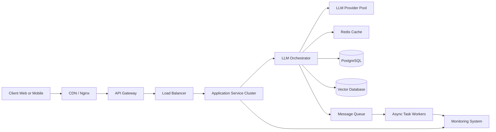
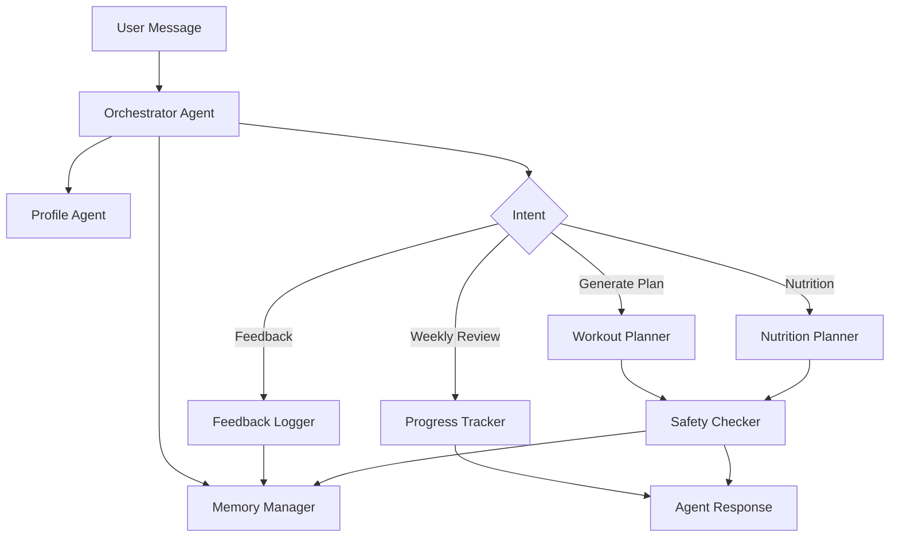
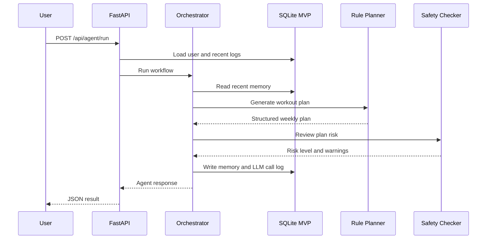
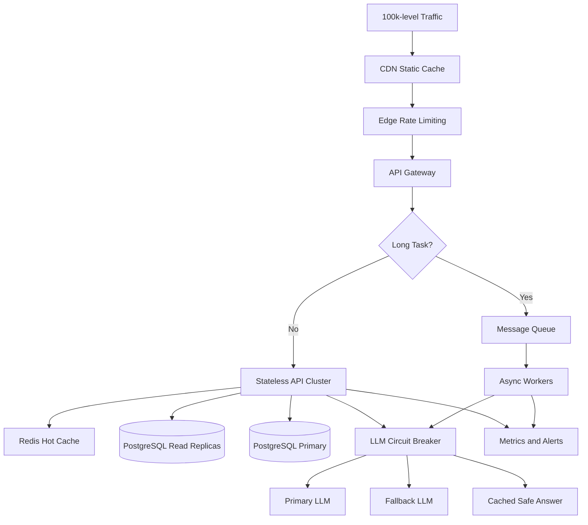

# FitAgent System Design Diagrams

## Overall System Architecture

```mermaid
flowchart LR
  Client[Client Web or Mobile] --> CDN[CDN / Nginx]
  CDN --> Gateway[API Gateway]
  Gateway --> LB[Load Balancer]
  LB --> App[Application Service Cluster]
  App --> Orch[LLM Orchestrator]
  Orch --> Pool[LLM Provider Pool]
  Orch --> Redis[Redis Cache]
  Orch --> PG[(PostgreSQL)]
  Orch --> Vector[(Vector Database)]
  Orch --> MQ[Message Queue]
  MQ --> Workers[Async Task Workers]
  App --> Monitor[Monitoring System]
  Workers --> Monitor
```

## Agent Workflow

```mermaid
flowchart TD
  U[User Message] --> O[Orchestrator Agent]
  O --> P[Profile Agent]
  O --> M[Memory Manager]
  O --> I{Intent}
  I -->|Generate Plan| W[Workout Planner]
  I -->|Nutrition| N[Nutrition Planner]
  I -->|Weekly Review| T[Progress Tracker]
  I -->|Feedback| F[Feedback Logger]
  W --> S[Safety Checker]
  N --> S
  T --> R[Agent Response]
  F --> M
  S --> M
  S --> R
```

## Data Flow

```mermaid
sequenceDiagram
  participant User
  participant API as FastAPI
  participant Agent as Orchestrator
  participant DB as SQLite MVP
  participant Planner as Rule Planner
  participant Safety as Safety Checker

  User->>API: POST /api/agent/run
  API->>DB: Load user and recent logs
  API->>Agent: Run workflow
  Agent->>DB: Read recent memory
  Agent->>Planner: Generate workout plan
  Planner-->>Agent: Structured weekly plan
  Agent->>Safety: Review plan risk
  Safety-->>Agent: Risk level and warnings
  Agent->>DB: Write memory and LLM call log
  Agent-->>API: Agent response
  API-->>User: JSON result
```

## 100k Concurrency Handling

```mermaid
flowchart TB
  Traffic[100k-level Traffic] --> CDN[CDN Static Cache]
  CDN --> EdgeLimit[Edge Rate Limiting]
  EdgeLimit --> Gateway[API Gateway]
  Gateway --> Queueable{Long Task?}
  Queueable -->|No| APICluster[Stateless API Cluster]
  Queueable -->|Yes| MQ[Message Queue]
  APICluster --> Redis[Redis Hot Cache]
  APICluster --> ReadReplica[(PostgreSQL Read Replicas)]
  APICluster --> Primary[(PostgreSQL Primary)]
  APICluster --> LLMCB[LLM Circuit Breaker]
  LLMCB --> PrimaryLLM[Primary LLM]
  LLMCB --> FallbackLLM[Fallback LLM]
  LLMCB --> Cached[Cached Safe Answer]
  MQ --> Workers[Async Workers]
  Workers --> LLMCB
  APICluster --> Metrics[Metrics and Alerts]
  Workers --> Metrics
```
